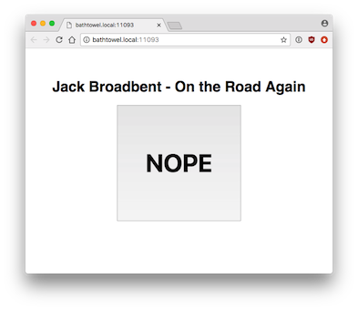

NOPE
====
A tiny server for offices with music. Hate what someone is playing? Press NOPE.



How it works
------------
The person playing music (say, using AirPlay) runs NOPE on their machine. On startup, it'll give them a URL to hand out and advertise the server over Bonjour.

On visiting the web address people are presented with the current track playing and a single button saying "NOPE". Clicking it will cause the machine playing music to skip the current track in Spotify, or another specified application.

The person pressing NOPE should also call out "NOPE!" as they do so. Because.

But asking people for the URL is annoying
-----------------------------------------
Nope also registers a Bonjour _nope service, meaning machines on the local network can query for nope servers. There's a terrible bash script called ````nope_locate.sh```` that will list all available nope servers on your network.

If you want to run it quickly without downloading anything, drop this in a terminal:
``curl -s https://raw.githubusercontent.com/Jonty/NOPE/master/nope_locate.sh | bash``

But I hate websites
-------------------
If you want to programmatically call NOPE (or just do it from the CLI), any POST request to the NOPE endpoint will cause a skip. I have it plugged into an Alfred workflow, for example.

Curl example:
````curl -X POST http://acomputermachine.local:11093````

Installing
----------
This is OSX only right now. You shouldn't need to install anything as NOPE just uses standard system libraries. If you want to send skips to an app other than Spotify, pass the name of the app as the only argument (e.g. ````python3 nope.py iTunes````).

But I want someone else to run it who hates installing things
-------------------------------------------------------------
No installation necessary! Get them to paste this into a terminal and hit enter.

````curl -s https://raw.githubusercontent.com/Jonty/NOPE/master/nope.py?1 | python3````

Caveats
-------
* This only works on a Mac right now (although any OS can use the button), it should be trivial to add Linux support using xlib, but you can't make me.
